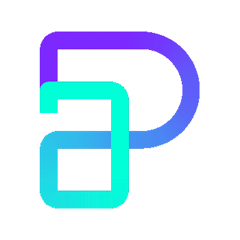
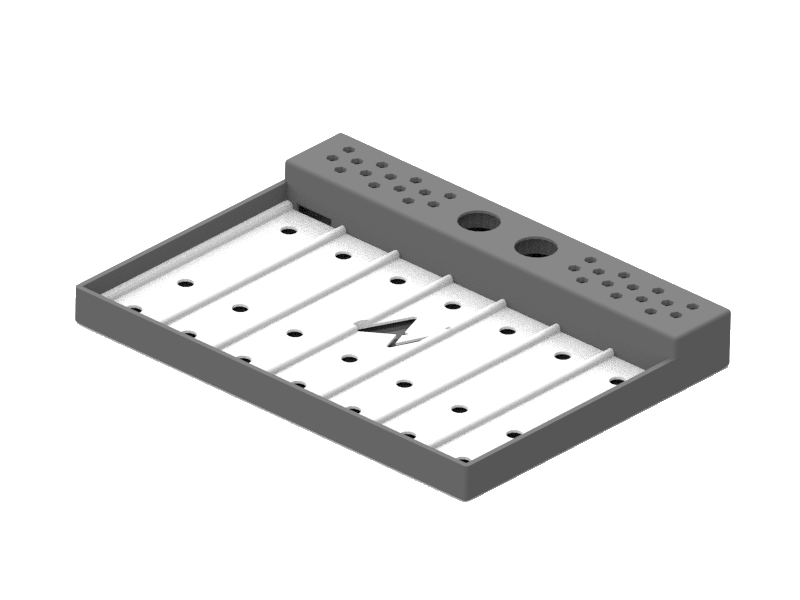

<!--
*** Thanks for checking out the Best-README-Template. If you have a suggestion
*** that would make this better, please fork the repo and create a pull request
*** or simply open an issue with the tag "enhancement".
*** Don't forget to give the project a star!
*** Thanks again! Now go create something AMAZING! :D
-->

<!-- PROJECT SHIELDS -->
<!--
*** I'm using markdown "reference style" links for readability.
*** Reference links are enclosed in brackets [ ] instead of parentheses ( ).
*** See the bottom of this document for the declaration of the reference variables
*** for contributors-url, forks-url, etc. This is an optional, concise syntax you may use.
*** https://www.markdownguide.org/basic-syntax/#reference-style-links
-->

<!-- PROJECT LOGO -->
 

  
  <h3 align="center">Pill Assitant</h3>
  

    An assistant that helps elderly people take their dayli pills
    
  

  

<!-- CONTACT -->
## Contact

Alejandro Vazquez - [@Ale_v_q](https://twitter.com/ale_v_q)

Email - [Alejandro.v.quintano@gmail.com](mailto:Alejandro.v.quintano@gmail.com)

Project Link: [https://github.com/Jandro5vq/Pill-Assistant](https://github.com/Jandro5vq/Pill-Assitant)

(<a href="#top">back to top</a>)

